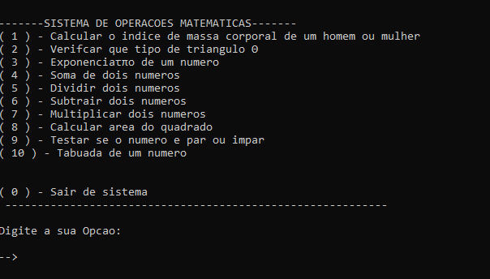

# Calculadora-CPP

<t "English version" /t>  

C++ Calculator: This project is a complete calculator implementation, developed in C++, with basic and advanced functions. It includes basic arithmetic operations such as addition, subtraction, multiplication and division, as well as operations such as square root, exponentiation and percentage calculation. The project has a user-friendly and easy-to-use interface, with input validation to ensure calculation accuracy. In addition, it includes the ability to store and retrieve recent results. This project was developed as a college assignment.

  

Versão em portugues 

Calculadora em C++: Este projeto é uma implementação de uma calculadora completa, desenvolvida em C++, com funções básicas e avançadas. Ele inclui operações aritméticas básicas, como adição, subtração, multiplicação e divisão, além de operações como raiz quadrada, potenciação e cálculo de porcentagem. O projeto possui uma interface amigável e fácil de usar, com validação de entrada para garantir a precisão dos cálculos. Além disso, ele inclui a capacidade de armazenar e recuperar resultados recentes. Este projeto foi desenvolvido como trabalho de faculdade.
